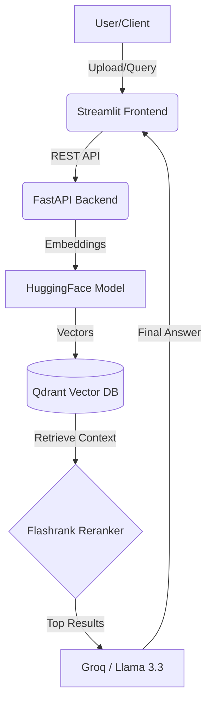

# 🏢 Enterprise Multi-Tenant RAG Platform

An advanced, production-ready Retrieval-Augmented Generation (RAG) system. This platform is designed to handle document intelligence for multiple organizations (Multi-Tenancy) with high-precision retrieval using **Flashrank Reranking** and **Qdrant Vector Database**.

---

## 🏗️ Project Architecture & Flow

The project is designed with a clear separation of concerns, featuring a robust **FastAPI** backend and an intuitive **Streamlit** frontend.


## 🚀 Key Technical Features

### 1. High-Precision Retrieval (Reranking)
Beyond standard vector search, this system implements a **Reranking** layer using **Flashrank**. This ensures the LLM receives only the most contextually relevant snippets, significantly reducing hallucinations.

**🔍 Smart Extraction Example:**

*The AI accurately extracts specific technical metrics (e.g., "Reduced manual efforts by 20%").*

### 2. Multi-Tenant Data Isolation
Security is a priority. Using **Metadata Filtering**, the system ensures strict data isolation between different `company_id`s.

**🔒 Privacy in Action:**

*The system refuses to answer questions if the data belongs to a different tenant ID.*

### 3. Comprehensive Ingestion Pipeline
The platform supports automated indexing for PDF, DOCX, and HTML files, utilizing `RecursiveCharacterTextSplitter` for optimal context preservation.

---

## 📸 Platform Demo

### 🗨️ Intelligent Querying
The assistant is capable of answering complex professional questions by scanning through the uploaded knowledge base.


### 🛠️ Technical Tool Identification
The system identifies specific frameworks and tools mentioned within the documents with high accuracy.


---

## 🛠️ Tech Stack

* **LLM**: Llama 3.3 (via Groq Cloud)
* **Orchestration**: LangChain
* **Vector DB**: Qdrant
* **Backend**: FastAPI
* **Frontend**: Streamlit
* **Reranker**: Flashrank
* **Embeddings**: HuggingFace `all-MiniLM-L6-v2`
* **Observability: LangSmith

---

## ⚙️ Installation & Setup

1. **Create Virtual Environment:**
   ```bash
   python -m venv venv
   source venv/Scripts/activate  # On Windows
   pip install -r requirements.txt
2. ** Environment Variables: Create a .env file in the root directory:**
   ```bash
   GROQ_API_KEY=your_groq_api_key
   QDRANT_HOST=localhost

3. **Run with Docker (Qdrant):**
   ```bash
   docker-compose up -d

4. **Launch Application:**
   **Backend:**
   ```bash
   uvicorn backend.main:app --reload
   ```
   **Frontend**
   ```bash
   streamlit run frontend/app.py
   ```
5. **🧪 Testing & Quality Assurance:**
   ```bash
   pytest
   ```
   
## 📈 Observability & Monitoring: 

**The pipeline is integrated with LangSmith to provide full trace visibility. This allows for:
   1-Monitoring retrieval quality and Reranker performance.
   2-Tracking latency and token costs.
   3-Debugging complex chains to ensure response reliability.**
---
## 🚦 Getting Started

1. **Clone the Repo:**
   ```bash
   git clone [https://github.com/amira-mhmd-ml/enterprise-rag.git](https://github.com/amira-mhmd-ml/enterprise-rag.git)
